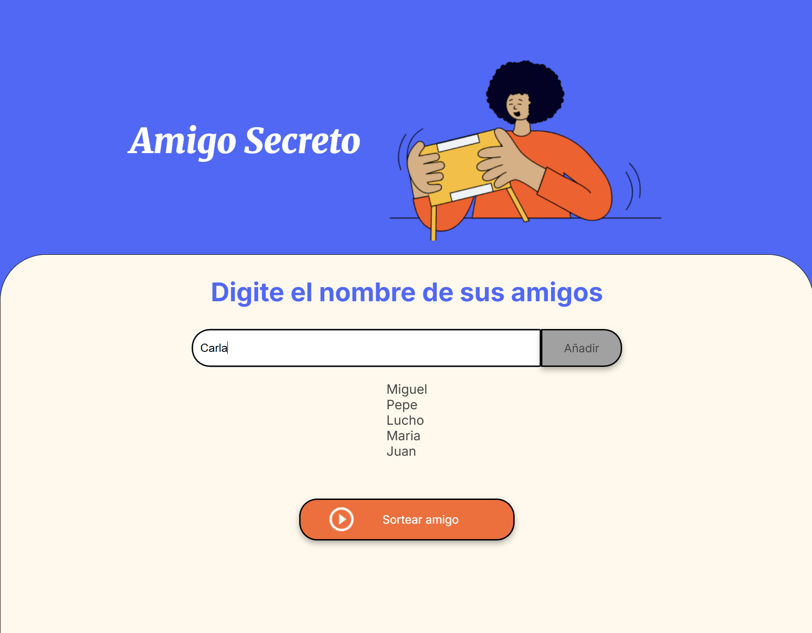

# 🎁 Challenge: Amigo Secreto

Este proyecto es parte de un desafío cuyo objetivo principal es **fortalecer las habilidades en lógica de programación** mediante la implementación de un sencillo juego del **Amigo Secreto**.

---

## 🚀 Objetivo del Proyecto

El reto consiste en:

* Crear un programa que permita **registrar nombres de amigos**.
* Validar que los nombres ingresados no estén vacíos.
* Mostrar la lista actualizada de amigos.
* Realizar un **sorteo aleatorio** para elegir un "Amigo Secreto".
* Reiniciar la lista de amigos después del sorteo.

---

## 🛠️ Tecnologías Utilizadas

* **HTML** → Estructura del proyecto.
* **CSS** → Estilos de la interfaz.
* **JavaScript** → Lógica de programación para la gestión de amigos y el sorteo.

---

## 📂 Estructura del Proyecto

```
├── index.html        # Interfaz principal
├── style.css         # Estilos personalizados
├── script.js         # Lógica del juego Amigo Secreto
└── assets/           # Recursos estáticos (imágenes, íconos, etc.)
```

---

## ⚙️ Funcionalidades Principales

* **Agregar amigo** → Permite registrar un nuevo nombre en la lista.
* **Validar entrada** → Evita nombres vacíos y muestra alertas.
* **Actualizar lista** → Visualiza en pantalla todos los amigos agregados.
* **Sortear amigo secreto** → Selecciona un amigo al azar entre los registrados.
* **Reiniciar lista** → Limpia los datos después de realizar un sorteo.

---

## 🖥️ Uso del Proyecto

1. Abrir el archivo `index.html` en tu navegador.
2. Ingresar los nombres de los amigos en el campo de texto.
3. Hacer clic en **"Agregar Amigo"** para sumarlo a la lista.
4. Cuando haya al menos **2 amigos**, hacer clic en **"Sortear"**.
5. El sistema elegirá un Amigo Secreto al azar y mostrará el resultado.

---

## 📸 Vista previa



---

## 📚 Aprendizajes Clave

* Manejo de arrays en JavaScript (`push`, acceso por índice, reinicio de lista).
* Manipulación del DOM para mostrar resultados dinámicos.
* Validaciones simples en formularios.
* Uso de funciones y eventos para estructurar la lógica.

---

## 🤝 Contribuciones

Si quieres mejorar este proyecto:

1. Haz un **fork** del repositorio.
2. Crea una nueva rama (`git checkout -b mejora-funcionalidad`).
3. Realiza tus cambios y haz un **commit**.
4. Envía un **pull request**.

---

## 🧑‍💻 Autor

Proyecto desarrollado por **Miguel Laisa** como parte de un desafío para mejorar la lógica de programación.
